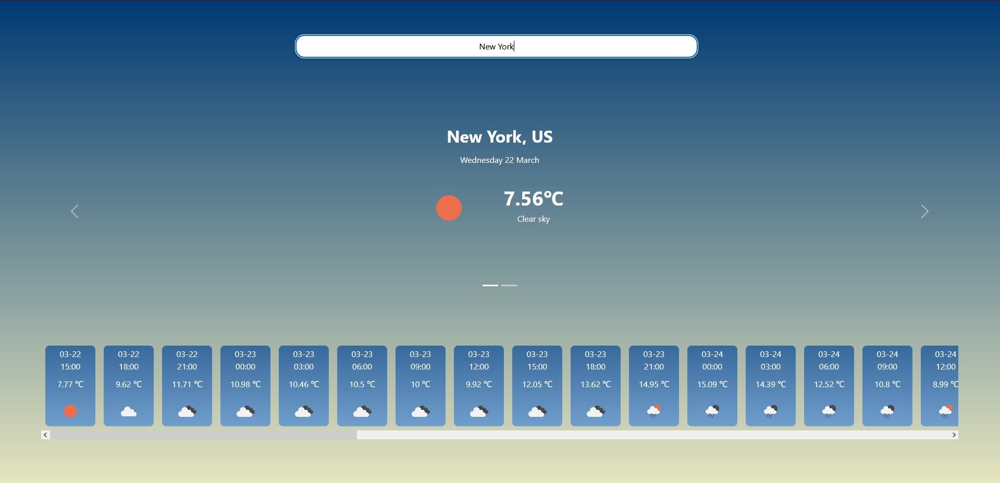

# React Weather App



This React app allows users to check the current weather and 5-day forecast of any city in the world using the OpenWeather API.

## Getting started

To get started with the app, clone the repository and install the necessary dependencies:

## Clone the repository
```
https://github.com/bBravee/weather-app-react.git
```

## Go inside the directory
```
cd weather-app-react
```

## Install dependencies
```
npm install
```

## Usage

To use the app, you will need to sign up for a free API key on the OpenWeather website. Once you have your API key, open the src/components/CitySearch/CitySearch.js file and replace the apiKey const with your API key.

```
const apiKey = 'YOUR_API_KEY_HERE';
```
To run the app locally, run the following command:

```
npm start
```
This will start the app on http://localhost:3000/.

## API Endpoints

The app uses 3 different API endpoints to retrieve the weather data:

1. **City Coordinates API Endpoint:** This API endpoint is used to get the coordinates of the entered city. The endpoint URL is http://api.openweathermap.org/geo/1.0/direct?q={city}&limit=5&appid={apiKey}.

2. **5-Day Forecast API Endpoint:** This API endpoint is used to get the 5-day weather forecast for the city of the entered coordinates. The endpoint URL is https://api.openweathermap.org/data/2.5/forecast?lat={lat}&lon={lon}&appid={apiKey}&units=metric.

3. **Current Weather API Endpoint:** This API endpoint is used to get the current weather conditions of the entered city. The endpoint URL is https://api.openweathermap.org/data/2.5/weather?q={city}&appid={apiKey}&units=metric.

## Error Handling

The app has basic error handling for failed API requests. If an API request fails, the app will display an error message to the user.

## Responsive Design

The app is designed to be responsive and work well on desktop and mobile devices.

